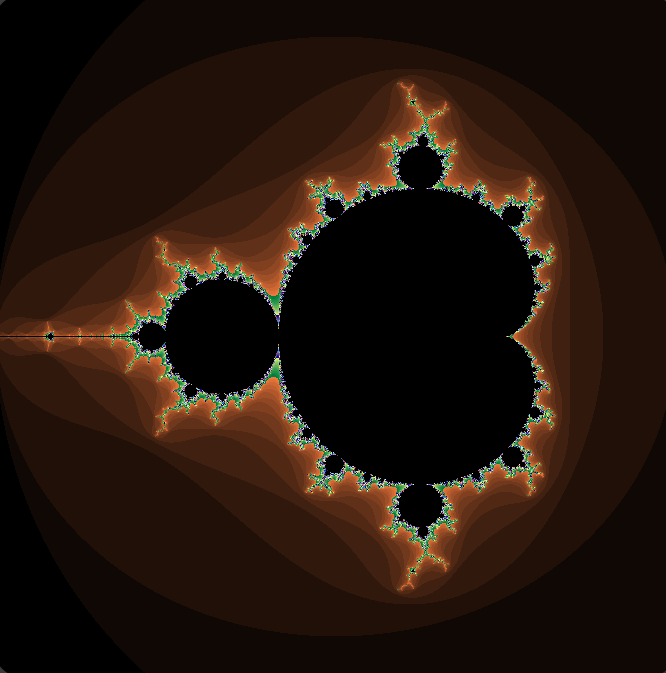
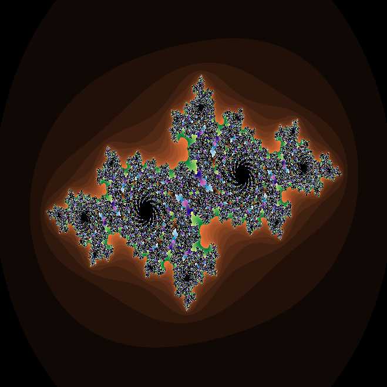
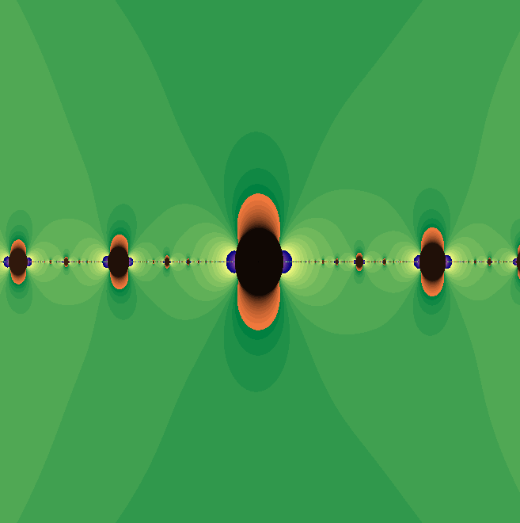

# Fractal-Generator
Welcome to my Interative Fractal Generator!

This generator lets you zoom in and move around in the Mandelbrot, Julia, and Dr. Tova Brown's Set. You also can change the constant values using the Julia Set and another fractal created by Dr. Tova Brown.

## Download
Clone the repo if you want to use this on your device.

## Change canvas resolution
To change the resolution, change the width and height here in fractal.html
```html
<canvas id="canvas" width="680" height="680"></canvas>
```

## Images
#Mandelbrot


#Julia Set


#Dr. Brown's



##Instructions
Follow on-screen instructions to move around the fractal
